# Ollibraria
Ol'Libraria is an web application for customer to buy books, and for the shop owner to manage books. This website was made by ASP.NET and was developed with Domain Drive Design (DDD) architecture. Which means this application uses layers such as:

1. View -- to show information to the user and interpret their commands.
2. Controller -- to validate all input from the view layer.
3. Handler -- to handle all business logic required in the application such as query from database.
4. Repository -- to give access to the database and model layer by referencing preexisting domain objects.
5. Factory -- for encapsulating all complex object creation.
6. Model -- for representing concepts in the business, and their relations with one another.

Ol'Libraria was made in Visual Studio, uses SQL Server Express LocalDB, means the database is included within the project and there's no need for external connection. This web application incorporates features such as:
1. Input validations that will be triggered if a user entered an invalid input.
2. Remember Me functions by saving the users cookies.

# Startup Guide
1. Install Microsoft's Visual Studio.
2. Open the [Ollibraria.sln](Ollibraria.sln) in Visual Studio.
3. Open [Login.aspx](Ollibraria/View/Login.aspx) in Visual Studio's editor and run the program.

# Entity Relationship Diagram for Ollibraria's Database
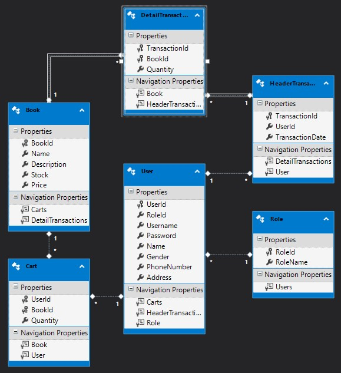

Entitiy Relationship Diagram (ERD) for the Ollibraria's application database. Which shows how each model interact with one another and what values they store inside of them.

Below is the preview and/or flow of the application:

# Login Page
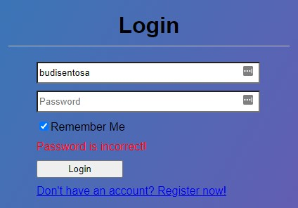

This page is the landing page of the website where the user will attempt to log in to the website. Your role in the web application will be determined by your username and password. An administrator have their username and password set as 'admin' and 'admin' respectively.

# Register Page
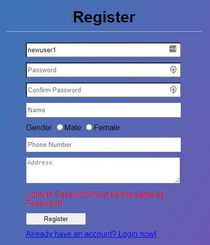

This page allows guests to register themselves as Ollibraria’s members. Will display an error if user input is invalid such as if the user input phone number with anything that isn't a numerical value.

# Home (as Member)

After success logged in, the user will be redirected to the home page and this page is only accessible by logged-in users. If you're a Member then you will be shown the menu to the picture above.

# Home (as Administrator)
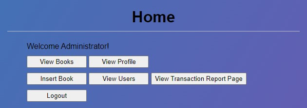

The Home menu but as an administrator opens new menus that are only accessible as an Administrator. Those menu are shown above.

# View Books Page (as Member)
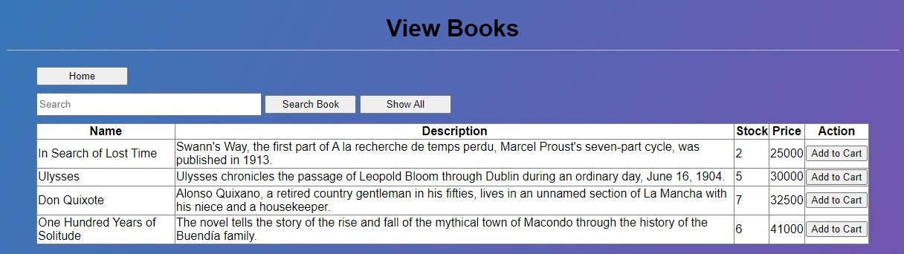

This page allows users to see all of Ollibraria’s books information, fetched from the database. The user will be redirected to this page when they clicked the View Books Button provided at the Home Page. As a member you can add these books to the cart.

# View Books Page (as Administrator)
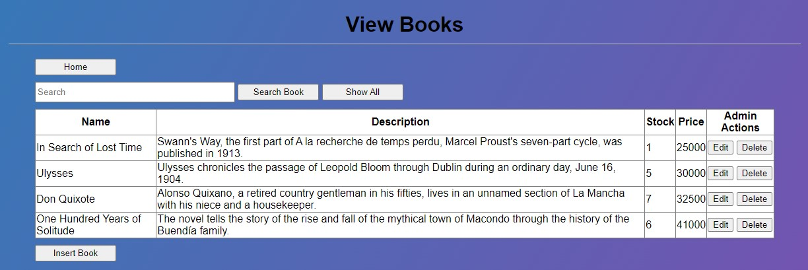

View Books as an Administrator is almost the same as Member, but instead of the button adding books to the cart, it will instead allow you to edit or delete those books from the database.

# View Carts Page
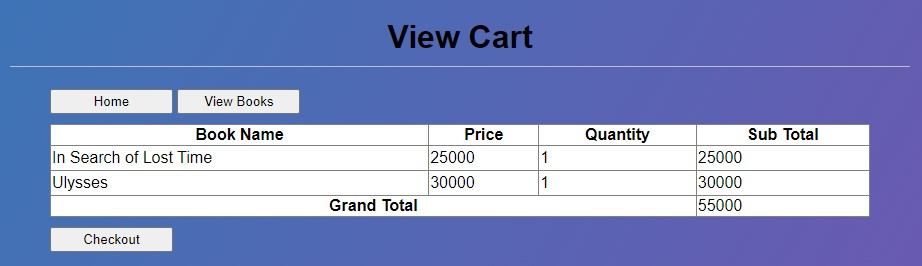

This page displays all books that have been added into the current logged-in user’s shopping cart. Cart will show informations about the book the user is about to checkout, such as name, price, quantity, sub total, and grand total.

# Add to Cart Page
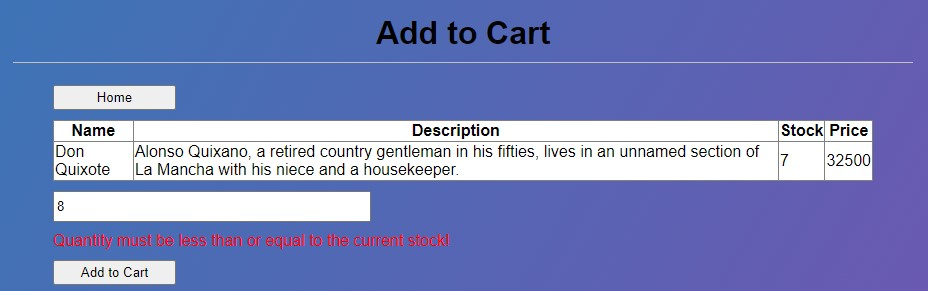

This page allows a member to insert the number of books that he/she wants to add to the cart. Input validation in this page include: not being allowed to input number of books that are more than their current quantity, and non-numerical input.

# Profile Page
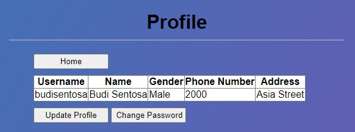

This page allows Member and Administrator to view their data, which will show their username, name, gender, phone number, and address. And shows you a button to update profile or change password.

# Update Profile Page
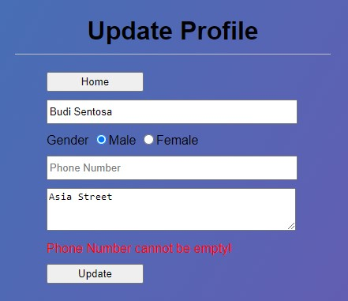

Update profile can be accessed from the Profile page if the user wants to change their profile information. After user input their updated information, user can press the update button to update their profile in the database.

# Change Password Page
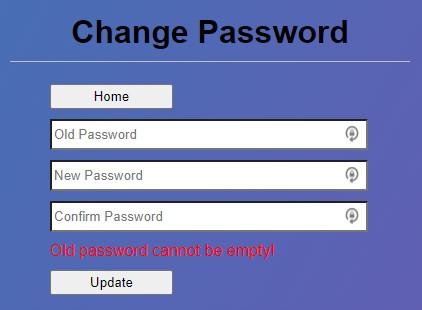

A user can change their password from the Profile page, data required to change a user's password is for them to input their old password, and enter their new password two times. Input validation in here is new password must be longer than 5 characters and cannot be empty.

# View Transaction History Page
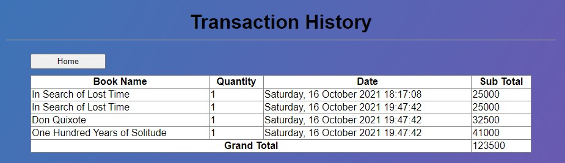

This page is accessible only to Members. View Transaction History will show the current user's transaction history, the information shown is books name, quantity ordered, date, sub total of that transaction, and the grand total of all transactions.

# Insert Books Page
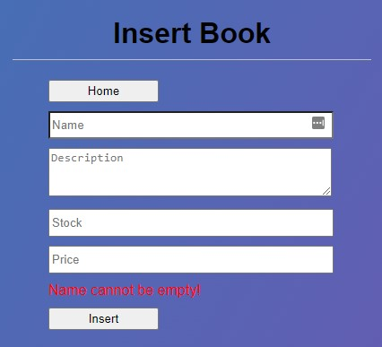

Insert Books page is accessible only to Administrator. In this page, admin can insert a new book to the database by filling the information and then clicking the Insert button. Input validations in this page are: description must be longer than 10 characters, stock must be more than 0 and numeric.

# Update Books Page
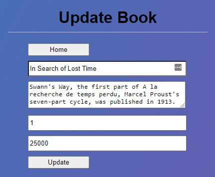

Update Medicine page is accessible only to Administrator. This page allows an admin to update an existing books in the database. After filling the books information, admin can click the update button to update this book's information to the database.

# View Users Page
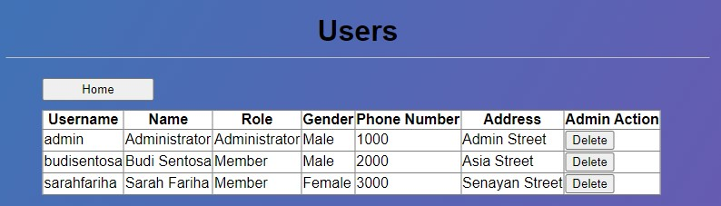

View Users page is accessible only to Administrator. This page allows an admin to view all users that exist in the database. Administrator can also delete that user from the database by clicking the delete button to prevent them from logging in the web application.

# View Transaction Report Page
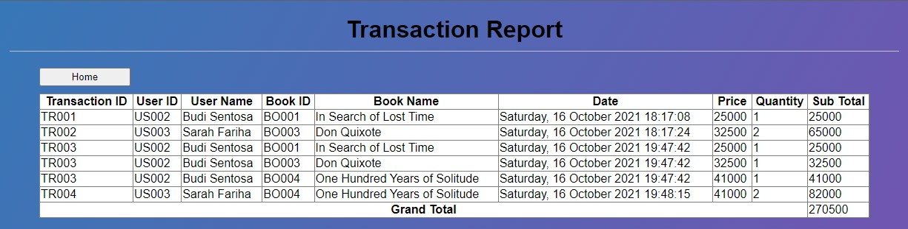

Last page for Administrator is the View Transaction Report page. This page will show Administrator every transactions that have happened in Ollibraria. Information shown are transaction id, user name, book name, date of transaction, price, quantity, sub total, and grand total of all transactions.
